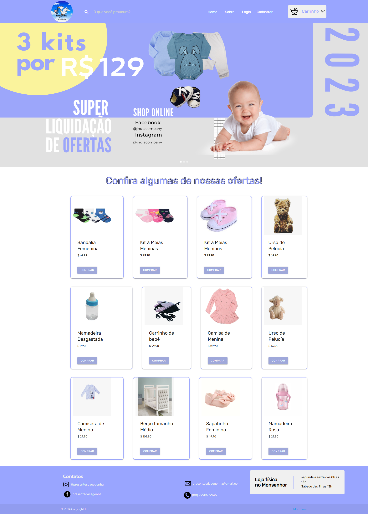
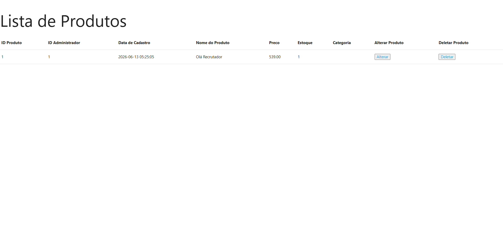
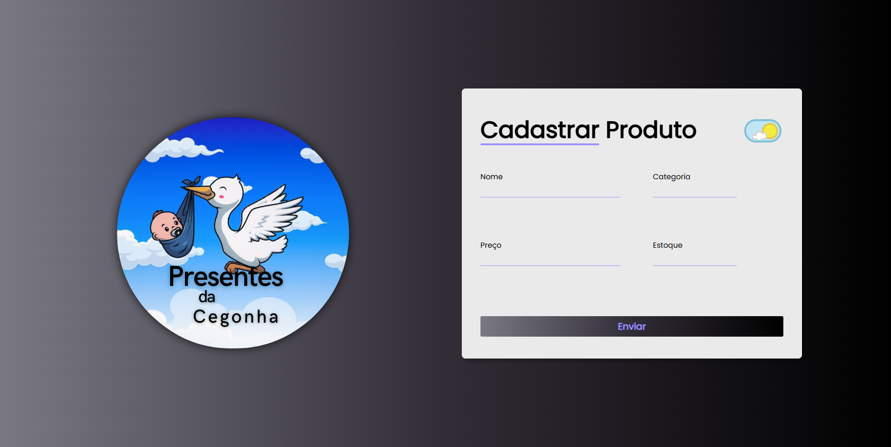
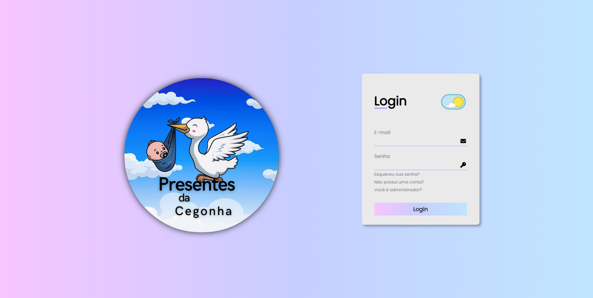
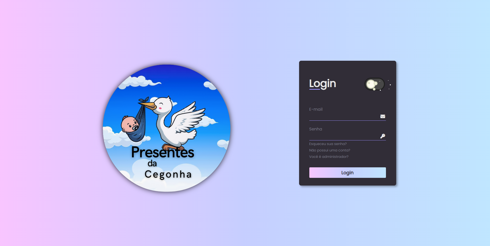
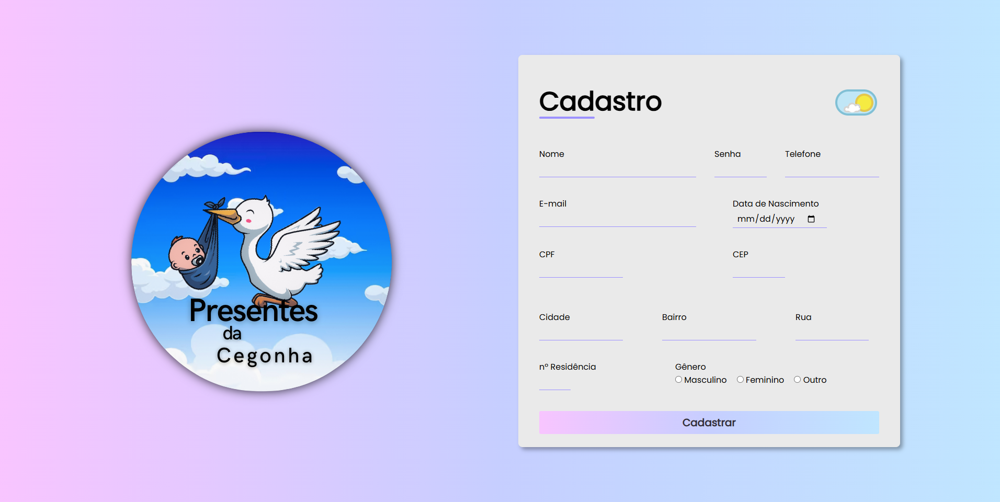
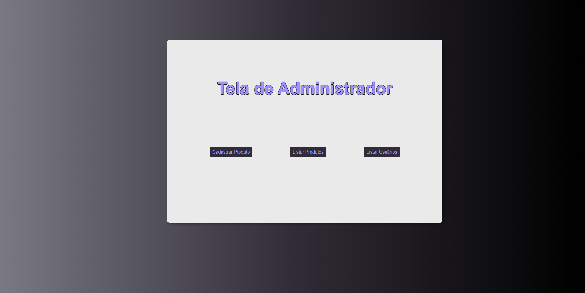

# 🐣 Presentes da Cegonha — E-commerce

Projeto de conclusão de curso desenvolvido em dupla, simulando um e-commerce completo de produtos infantis com painel administrativo, carrinho de compras e autenticação de usuários.

---

## 🖼️ Preview

### Página inicial


### Catálogo de produtos


### Painel administrativo - Cadastro de produto


<details>
<summary>📸 Ver mais screenshots (login, cadastro, dark mode)</summary>

#### Login


#### Login - Dark Mode


#### Cadastro de cliente


#### Tela administrativa


</details>

---

## 🖥️ Sobre o projeto

A **Presentes da Cegonha** é uma loja virtual de produtos para bebês e crianças, desenvolvida como projeto final do curso Técnico em Informática. O projeto contempla desde a interface do cliente até o painel administrativo, com integração a banco de dados MySQL e autenticação via Google.

---

## ✨ Funcionalidades

**Cliente:**
- 🛍️ Vitrine de produtos com cards e imagens
- 🛒 Carrinho de compras com resumo do pedido
- 👤 Cadastro e login de usuários
- 🔐 Login social com **Google (OAuth)**
- 💳 Tela de pagamento
- 📱 Menu responsivo (mobile e desktop)
- 🎠 Carousel de banners promocionais

**Administrador:**
- 🔑 Painel admin com login separado
- 📦 Cadastrar, editar e deletar produtos
- 👥 Listar e gerenciar usuários
- 📊 Controle completo da loja

---

## 🛠️ Tecnologias utilizadas


---

## 📁 Estrutura do projeto

```
presentes_da_cegonha/
├── index.php               # Página principal (vitrine)
├── login.php               # Login de clientes
├── login_admin.php         # Login de administradores
├── tela_admin.php          # Painel administrativo
├── cadastro_cliente.php    # Cadastro de usuários
├── carrinho.php            # Carrinho de compras
├── tela_pagamento.php      # Tela de pagamento
├── conexao.php             # Conexão com o banco de dados
├── css/                    # Estilos por página
├── js/                     # Scripts JavaScript
├── img/                    # Imagens e banners
├── produtos/               # Fotos dos produtos
└── bd_cegonha.sql          # Banco de dados MySQL
```

---

## ⚙️ Como rodar o projeto

1. Instale o [XAMPP](https://www.apachefriends.org/) ou similar
2. Clone o repositório na pasta `htdocs`
3. Importe o arquivo `bd_cegonha.sql` no phpMyAdmin
4. Configure as credenciais do banco em `conexao.php`
5. Acesse `http://localhost/presentes_da_cegonha`

---

## 👥 Equipe

| Função | Responsável |
|--------|------------|
| Front-End + apoio no Back-End | [Carlos Levi](https://github.com/leviroiz) |
| Back-End | Colaborador |

---

## 📚 O que aprendi

- Desenvolvimento full-stack com PHP e MySQL
- Autenticação de usuários e controle de sessões
- Integração com login social via Google OAuth
- CRUD completo com banco de dados relacional
- Uso de framework CSS profissional (Materialize)
- SCSS como pré-processador de CSS
- Trabalho em equipe com divisão de responsabilidades

---

## ⚠️ Observações

- Projeto desenvolvido para fins acadêmicos
- Não está em produção — requer ambiente local para execução
- As credenciais do banco em `conexao.php` devem ser ajustadas conforme o ambiente

---

<p align="center">Desenvolvido por <a href="https://github.com/leviroiz">Carlos Levi</a> e equipe • Projeto de Conclusão de Curso – 2023 🎓</p>
