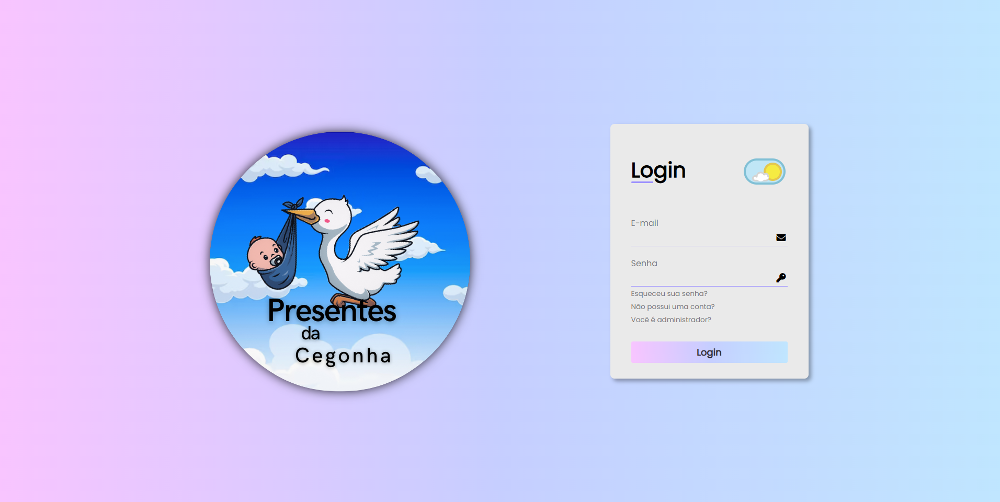
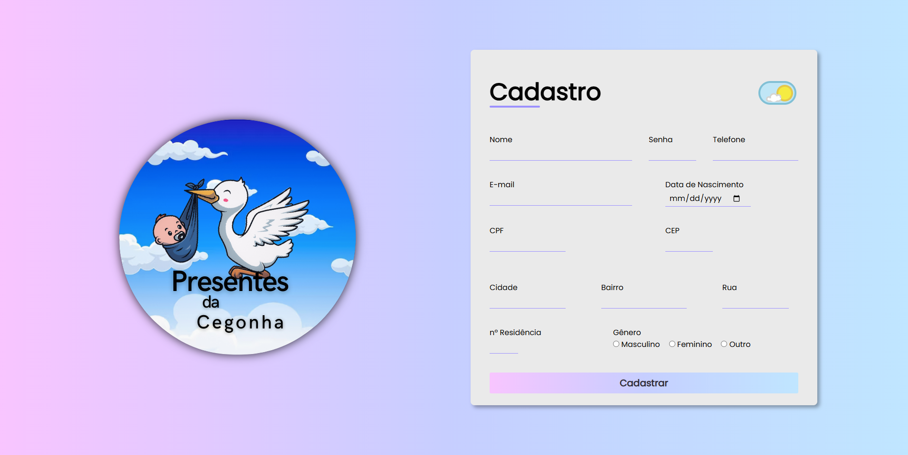
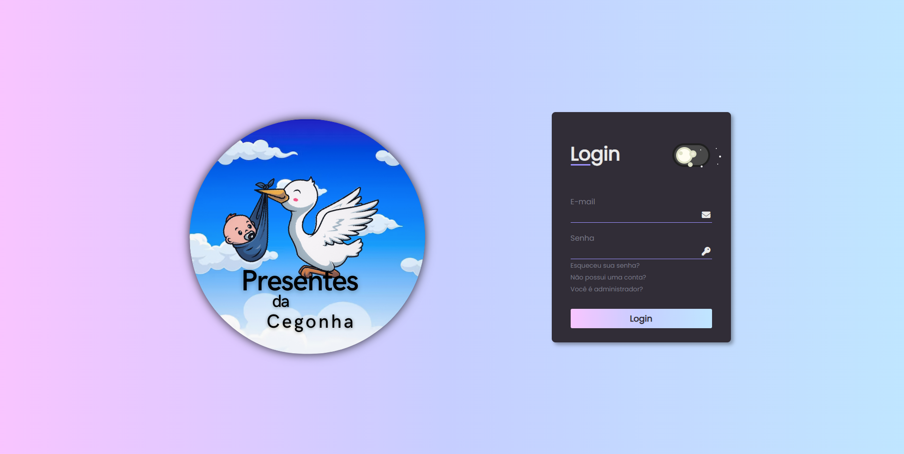
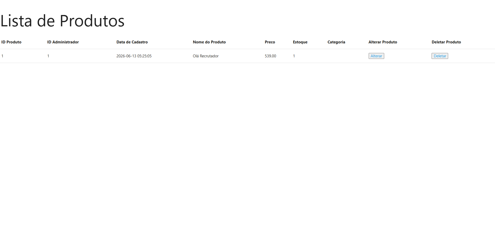
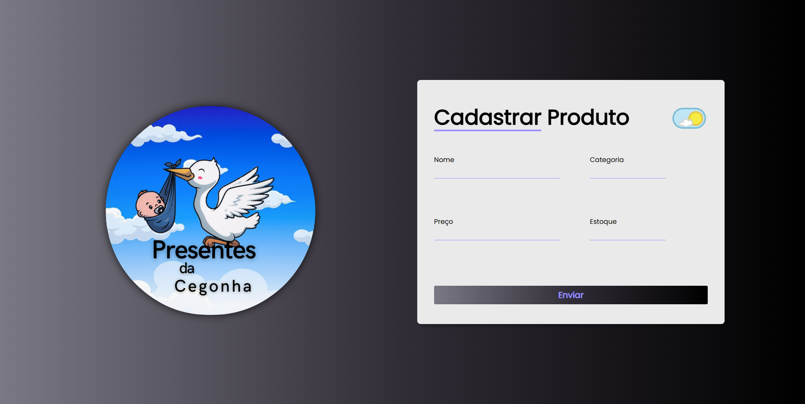
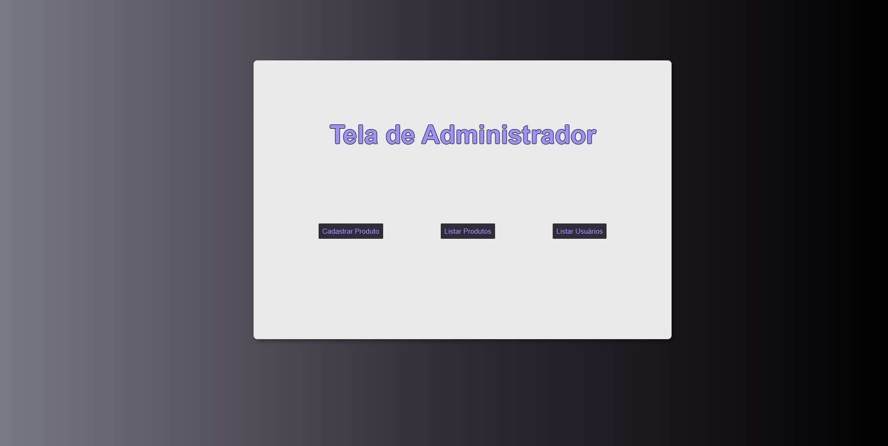

<div align="center">

# 🐣 Presentes da Cegonha

### E-commerce acadêmico em PHP e MariaDB, modernizado para portfólio

Projeto originalmente desenvolvido em 2023 e posteriormente revisado com foco em **segurança, qualidade de código, testes automatizados e ambiente reproduzível**.

[](https://github.com/leviroiz/presentes-da-cegonha/actions/workflows/quality.yml)


</div>

---

## 🎯 Sobre o projeto

O **Presentes da Cegonha** nasceu em 2023 como projeto de conclusão do curso Técnico em Informática.

Desenvolvido em dupla, o sistema simula um e-commerce de produtos infantis com:

- cadastro e autenticação de clientes;
- catálogo de produtos;
- fluxo demonstrativo de pedido;
- controle de estoque;
- painel administrativo;
- cadastro e gerenciamento de produtos e clientes.

Em 2026, retomei o projeto com outro objetivo: **transformar um trabalho acadêmico antigo em uma peça de portfólio tecnicamente mais madura**.

A identidade visual e parte da estrutura original foram preservadas, enquanto áreas críticas como autenticação, banco de dados, autorização, segurança e pedidos passaram por uma revisão significativa.

> Este continua sendo um projeto educacional.
>
> Pedidos e pagamentos são simulados e nenhum processamento financeiro real é realizado.

---

## 🖥️ Preview

### Login



### Cadastro de cliente



<details>
<summary><strong>📸 Ver mais telas</strong></summary>

<br>

### Login em modo escuro



### Gestão de produtos



### Cadastro de produto



### Painel administrativo



</details>

---

## 🛍️ Funcionalidades

### Cliente

O fluxo do cliente inclui:

- criação de conta;
- validação dos dados no servidor;
- armazenamento seguro de senha;
- autenticação por sessão;
- catálogo de produtos;
- visualização de produtos;
- preenchimento de endereço;
- registro demonstrativo de pedido;
- validação de estoque;
- confirmação do pedido.

O carrinho visual original também foi preservado como parte do contexto acadêmico do projeto.

### Administração

O painel administrativo permite:

- autenticação separada do cliente;
- controle de acesso administrativo;
- cadastro de produtos;
- edição de produtos;
- listagem de produtos;
- exclusão de produtos;
- gerenciamento de clientes;
- atualização das informações;
- controle de estoque.

Operações que alteram estado utilizam requisições `POST` e proteção CSRF.

---

## 🔄 De projeto acadêmico a projeto de portfólio

Uma das partes mais importantes deste repositório é mostrar a evolução técnica do projeto.

| Versão acadêmica — 2023 | Versão modernizada |
|---|---|
| SQL construído por concatenação | Prepared statements com `mysqli` |
| Senhas armazenadas em texto puro | `password_hash()` e `password_verify()` |
| Credenciais presentes no código | Variáveis de ambiente |
| Operações sensíveis por GET | POST + CSRF + autorização |
| Verificação de sessão espalhada | Guardas de autenticação reutilizáveis |
| Dados do navegador tratados como confiáveis | Valores críticos validados no servidor |
| Pedido e estoque tratados separadamente | Operação transacional no banco |
| Dados pessoais de exemplo | Base sanitizada e dados fictícios |
| Login social apenas no navegador | Recurso removido até existir validação server-side |

A versão acadêmica original continua disponível na tag:

`v1-academico-2023`

A branch `main` representa a versão atualmente modernizada.

---

## 🔐 Segurança

A revisão do projeto identificou vários padrões comuns em aplicações desenvolvidas durante o início do aprendizado.

Em vez de esconder esse histórico, a modernização foi usada para estudar e implementar controles mais adequados.

### Controles implementados

- prepared statements com `mysqli`;
- `password_hash()` e `password_verify()`;
- regeneração do ID da sessão após autenticação;
- cookies de sessão com `HttpOnly`;
- `SameSite=Lax`;
- suporte a flag `Secure` por ambiente;
- separação entre autenticação de cliente e administrador;
- tokens CSRF em operações que alteram estado;
- exclusões administrativas por POST;
- validação server-side;
- escape de dados na saída HTML;
- credenciais por variáveis de ambiente;
- remoção de dados pessoais da base versionada;
- proteção contra acesso HTTP direto a arquivos internos;
- preço do pedido definido pelo servidor;
- baixa de estoque transacional.

A análise completa está documentada em:

👉 [docs/SECURITY_REVIEW.md](./docs/SECURITY_REVIEW.md)

---

## 💳 Pedido e integridade do estoque

Um dos fluxos revisados com mais cuidado foi o registro do pedido.

Na versão modernizada, o valor recebido do navegador **não é considerado fonte confiável para o preço**.

O fluxo segue a lógica:

```text
Cliente seleciona produto
        ↓
Servidor recebe o ID
        ↓
Produto é consultado no banco
        ↓
Preço real é obtido pelo servidor
        ↓
Estoque é validado
        ↓
Pedido é registrado
        ↓
Estoque é atualizado
        ↓
Transação é concluída
```

Isso evita que alterações feitas no frontend sejam utilizadas para modificar o valor efetivamente registrado pelo sistema.

A gravação do pedido e a atualização de estoque são tratadas de forma transacional.

---

## 🏗️ Arquitetura

A aplicação utiliza uma arquitetura PHP tradicional com páginas e endpoints server-side.

```text
Navegador
    ↓
HTML + CSS + JavaScript
    ↓
PHP 8.2
    ↓
Autenticação / CSRF / Regras de negócio
    ↓
mysqli
    ↓
MariaDB
```

O projeto preserva parte da arquitetura original para manter seu contexto acadêmico, enquanto componentes compartilhados foram reorganizados durante a modernização.

---

## 🛠️ Tecnologias

### Backend e dados


- PHP 8.2;
- `mysqli`;
- MariaDB / MySQL;
- SQL;
- sessões PHP.

### Frontend


- HTML5;
- CSS3;
- JavaScript;
- SCSS;
- Materialize CSS;
- jQuery.

### Ambiente e qualidade


- Docker;
- Docker Compose;
- Git;
- GitHub;
- GitHub Actions;
- testes automatizados.

---

## 🧪 Testes e CI

O projeto possui um pipeline executado automaticamente em `push` e `pull_request`.

```text
Push / Pull Request
        ↓
GitHub Actions
        ↓
PHP syntax check
        ↓
Security checks
        ↓
Smoke tests
        ↓
MariaDB isolado
        ↓
Servidor PHP de teste
        ↓
Testes HTTP de integração
```

### Quality checks

O CI executa:

```bash
find . -type f -name '*.php' -print0 | xargs -0 -n1 php -l

php scripts/security_check.php

php tests/security_smoke.php
```

### Testes de integração

Um segundo job sobe uma instância isolada do **MariaDB 11.4**, inicializa o banco, inicia a aplicação utilizando o servidor embutido do PHP e executa requisições HTTP contra o sistema.

Entre os comportamentos testados estão:

- acesso à página de cadastro;
- presença de cabeçalhos de segurança;
- bloqueio de escrita sem token CSRF;
- cadastro de cliente;
- persistência do cliente;
- senha armazenada utilizando hash;
- login do cliente;
- manutenção da sessão;
- bloqueio de painel administrativo para usuário anônimo;
- login administrativo;
- cadastro de produto;
- persistência no banco;
- edição de produto;
- listagem;
- exclusão;
- pedido demonstrativo;
- utilização do preço armazenado no servidor;
- redução correta do estoque;
- página de confirmação.

Os dados criados durante a suíte são fictícios e removidos após os testes.

---

## 🐳 Executando com Docker

### Pré-requisito

Docker Desktop com Docker Compose.

Clone o repositório:

```bash
git clone https://github.com/leviroiz/presentes-da-cegonha.git
cd presentes-da-cegonha
```

Crie o arquivo local de configuração:

```bash
cp .env.example .env
```

No PowerShell:

```powershell
Copy-Item .env.example .env
```

Edite as credenciais de exemplo no `.env`.

Depois execute:

```bash
docker compose up --build -d
```

Crie um administrador:

```bash
docker compose exec app php scripts/create_admin.php
```

Acesse:

```text
Loja
http://localhost:8080

Administração
http://localhost:8080/login_admin.php
```

Não existe usuário administrador padrão.

As credenciais são definidas localmente e o arquivo `.env` é ignorado pelo Git.

---

## 💻 Executando sem Docker

Também é possível executar o projeto diretamente.

Requisitos:

- PHP 8.2+;
- extensão `mysqli`;
- MySQL ou MariaDB.

Passos:

1. importe `bd_cegonha.sql`;
2. copie `.env.example` para `.env`;
3. configure as credenciais locais;
4. execute:

```bash
php scripts/create_admin.php
```

5. sirva a aplicação utilizando Apache ou:

```bash
php -S localhost:8080
```

---

## 📁 Estrutura principal

```text
presentes-da-cegonha/
│
├── .github/
│   └── workflows/
│       └── quality.yml
│
├── config/
│
├── database/
│   └── migrations/
│
├── docs/
│   └── SECURITY_REVIEW.md
│
├── includes/
│
├── scripts/
│
├── tests/
│
├── assets/
│
├── css/
├── js/
├── img/
│
├── bd_cegonha.sql
├── docker-compose.yml
├── Dockerfile
├── .env.example
└── *.php
```

---

## 🕒 Histórico preservado

O projeto mantém duas etapas importantes da sua evolução:

### `v1-academico-2023`

Versão original construída durante o curso Técnico em Informática.

Ela foi preservada como registro do projeto e do nível de conhecimento daquela época.

### `main`

Versão revisada para portfólio.

Inclui:

- modernização de segurança;
- reorganização de código;
- ambiente Docker;
- banco sanitizado;
- testes;
- integração contínua;
- documentação técnica.

Essa separação permite visualizar a evolução do projeto sem apagar seu contexto original.

---

## 👨‍💻 Minha participação

O projeto acadêmico original foi desenvolvido em dupla.

| Área | Participação |
|---|---|
| Interface e responsividade | **Carlos Levi** |
| Integração das telas | **Carlos Levi** |
| Backend original | Desenvolvimento em dupla |
| Auditoria de segurança em 2026 | **Carlos Levi** |
| Modernização para portfólio | **Carlos Levi** |
| Docker e ambiente reproduzível | **Carlos Levi** |
| Testes e CI | **Carlos Levi** |
| Documentação técnica | **Carlos Levi** |

Essa distinção é mantida para representar de forma transparente o que foi desenvolvido originalmente em equipe e o que foi realizado posteriormente durante a modernização.

---

## 📌 Limitações

Apesar das melhorias, este continua sendo um projeto acadêmico e não uma plataforma de comércio eletrônico pronta para produção.

Algumas limitações conhecidas:

- pagamento apenas demonstrativo;
- ausência de gateway de pagamento;
- carrinho original sem persistência completa de múltiplos itens;
- ausência de recuperação de senha;
- ausência de rate limiting;
- ausência de observabilidade de produção;
- requisitos de privacidade e LGPD não foram projetados para uso real.

O objetivo da modernização não foi transformar o projeto em um produto comercial, mas demonstrar evolução técnica e aplicar práticas aprendidas posteriormente.

---

## 🧠 O que este projeto demonstra

O Presentes da Cegonha representa principalmente a evolução entre **construir uma aplicação que funciona** e começar a pensar em **como construir software de forma mais segura, testável e reproduzível**.

O projeto reúne práticas relacionadas a:

- desenvolvimento backend com PHP;
- bancos relacionais;
- autenticação e sessões;
- segurança web;
- CSRF;
- prepared statements;
- hash de senhas;
- transações;
- integridade de estoque;
- desenvolvimento frontend;
- Docker;
- testes de integração;
- GitHub Actions;
- CI;
- Git e GitHub;
- manutenção e modernização de código legado.

---

## 👨‍💻 Autor

Modernização e manutenção por **Carlos Levi**.

Projeto acadêmico original desenvolvido em dupla em 2023.

[](https://github.com/leviroiz)
[](https://www.linkedin.com/in/leviroiz)

---

## 📄 Licença

Código disponibilizado sob a [Licença MIT](LICENSE).
